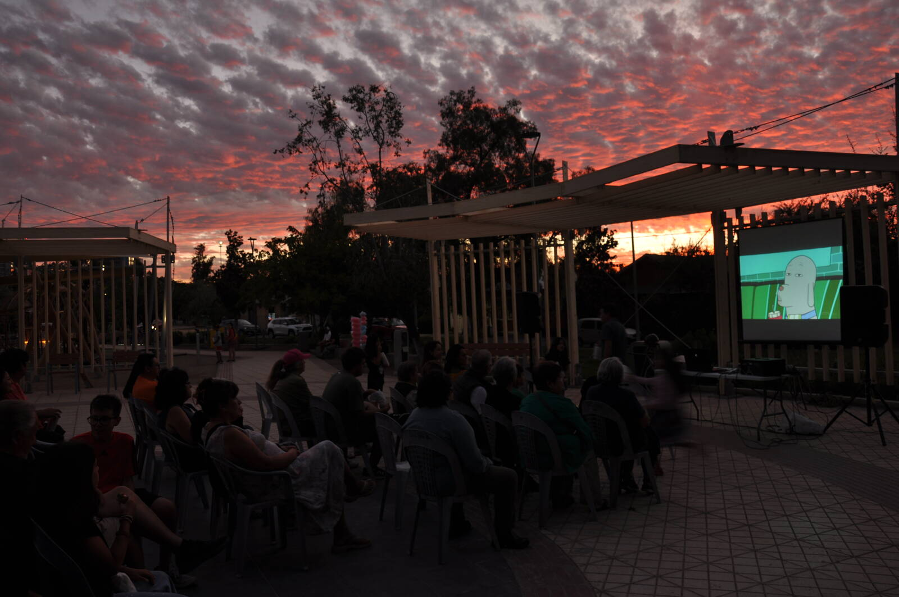

## La propuesta

COAS en Tour es un proyecto de proyecciones cinematográficas itinerantes, con la intención de generar difusión de cine en distintas partes de la comuna, utilizando las películas como herramienta de activación barrial, encuentro comunitario y acceso cultural.

## Cómo funciona cada jornada

Cada función sigue un formato de tres momentos: una presentación breve de la iniciativa y la película, la proyección en sí misma, y una conversación posterior sobre las temáticas abordadas, según el formato y el espacio que dispongamos.

## Recorrido

### Primer ciclo — Macul, verano 2026

Durante enero y febrero de 2026 realizamos nuestro primer ciclo de COAS en Tour en colaboración con la Junta de Vecinos Villa Santa Elena, en la comuna de Macul. Dos funciones al aire libre en la Plaza Dr. Pedro Flores que activaron el espacio público como punto de encuentro vecinal.

**Función 1 · *Superman* (James Gunn, 2025)**  
30 de enero de 2026 · Plaza Dr. Pedro Flores, Macul · Más de 30 asistentes

La selección fue acordada con el equipo de la junta de vecinos, buscando una película capaz de convocar tanto a niñas y niños como a personas adultas del sector. La función abrió la temporada y permitió un primer reconocimiento del espacio y de la audiencia barrial.

**Función 2 · *Mi amigo Robot* (Pablo Berger, 2023)**  
14 de febrero de 2026 · Plaza Dr. Pedro Flores, Macul · Más de 40 asistentes

Función especial de San Valentín, programada para convocar a parejas, familias y personas mayores. La obra de Berger —una historia sin diálogos sobre amistad, soledad y vínculos— resultó pertinente para un público intergeneracional y cerró el ciclo con una asistencia notablemente mayor que la primera función.

Con estas dos jornadas concluyó nuestra primera colaboración con la Junta de Vecinos Villa Santa Elena. El ciclo dejó aprendizajes concretos sobre programación situada, convocatoria territorial y el cine al aire libre como dispositivo de encuentro.

## Metodología

1. **Identificación territorial** — Mapeo de actores relevantes, espacios posibles y necesidades del sector.
2. **Coordinación con organizaciones** — Definición conjunta de horarios, temáticas y logística.
3. **Curaduría de programación** — Selección de películas pertinentes al contexto territorial.
4. **Realización de la jornada** — Preparación del espacio, proyección, conversatorio y cierre.
5. **Registro audiovisual** — Documentación de cada actividad.
6. **Sistematización** — Evaluación y análisis de datos para retroalimentar el proyecto.

## Espacios donde trabajamos

Juntas de vecinos y sedes comunitarias, bibliotecas municipales, centros culturales, canchas techadas, plazas y parques, y cualquier otro espacio que las comunidades dispongan.

## Programación

La itinerancia permite construir programaciones situadas. Las películas se seleccionan considerando el contexto territorial, con enfoque en la apreciación cinematográfica. Esto incluye cine chileno y latinoamericano, cine europeo y asiático, producciones independientes, y funciones con enfoques específicos (familiar, infantil, adultos mayores, jóvenes).