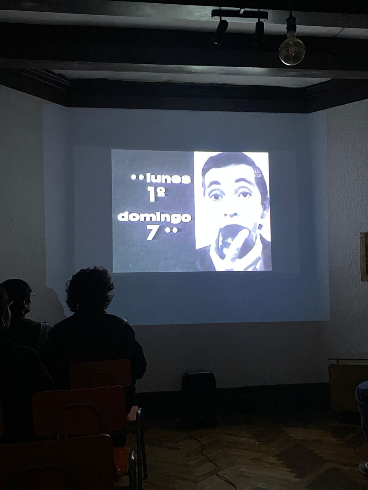
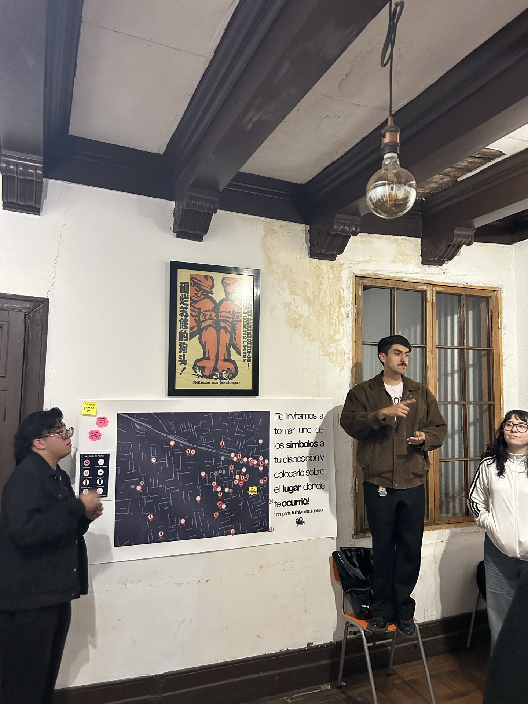
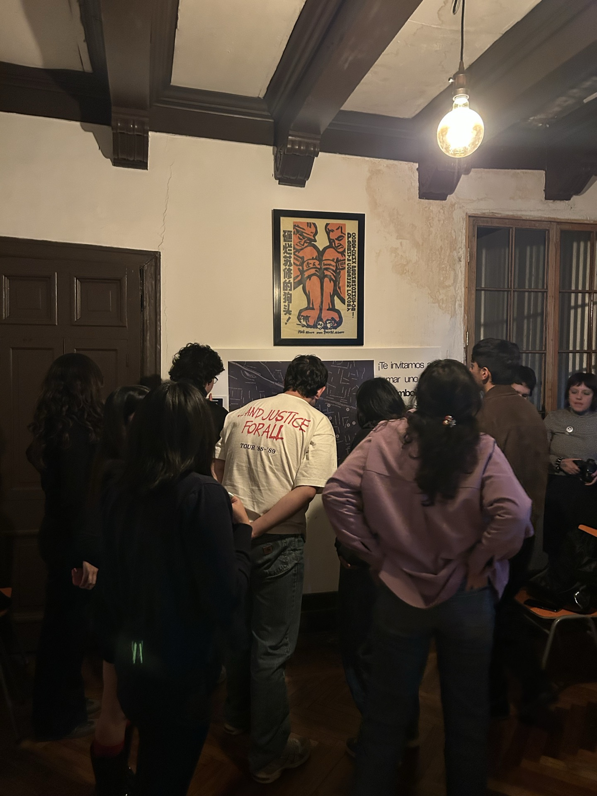

## El ciclo

¿Qué estamos viendo? es el primer ciclo continuado de COAS, realizado en alianza con la Librería Proyección, en San Francisco 51, Santiago Centro. Cada lunes, a partir del 14 de abril y durante todo abril y comienzos de mayo, ocupamos una de sus salas para proyectar una película o un programa de cortometrajes acompañado de una actividad de mediación.

El ciclo nace de una pregunta sencilla pero exigente: ¿qué estamos viendo cuando vemos cine? Detrás de esa pregunta hay otra: qué nos captura la mirada, qué nos hace volver a una imagen, qué nos lleva a discutir una escena días después. La programación es deliberadamente diversa —cine chileno, cine internacional, cortometrajes, ficción y documental— y se construye para que cada lunes abra una conversación sobre alguna dimensión del cine: la calidad técnica, la decisión narrativa, la inscripción histórica, la experiencia de quien mira.

La alianza con Librería Proyección es parte central de la propuesta. No es un espacio prestado: es un espacio que comparte la convicción de que el cine y el libro habitan el mismo territorio cultural, y que ambos pueden activarse mutuamente.

## Sesiones

### Sesión 1 · Lunes 14 de abril
#### *Lunes 1°, domingo 7* (Helvio Soto, 1968)

Abrimos el ciclo con una película que pocos cineclubes se atreven a rescatar. *Lunes 1°, domingo 7* es la primera obra de largometraje formal de Helvio Soto —cineasta clave del periodo previo al golpe, exiliado tras 1973—, una comedia romántica musical en blanco y negro que sigue, a lo largo de los siete días de la semana, el encuentro y desencuentro entre una estudiante de arte y un estudiante de medicina en el Santiago de fines de los años sesenta. Ochenta minutos de un cine ágil, ligero, con una estética sorprendentemente moderna para su época y una mirada cariñosa sobre la ciudad.

La elección no fue casual. La película fue rodada en Santiago Centro y especialmente en el Cerro Santa Lucía: el mismo barrio donde, casi sesenta años después, la proyectaríamos. Lo que en la pantalla aparece como geografía romántica de fines de los sesenta es, todavía hoy, un territorio cargado de memoria afectiva para quienes habitan el centro de la ciudad.

Es además una película semi-perdida: las copias en 35mm se consideran extraviadas y la película circula solo en ediciones restringidas en video. Programarla en un cineclub no es solo exhibir cine chileno: es contribuir, modestamente, a su circulación.

#### La actividad · Mapa afectivo de Santiago Centro

Después de la proyección abrimos sobre la mesa un mapa de Santiago Centro y repartimos stickers con frases cortas: *mi primer beso*, *tuve una cita*, entre otras. La consigna era simple: pegar el sticker en el lugar del mapa donde el hito había ocurrido.

A medida que avanzaba la actividad ocurrió algo que no estaba completamente previsto pero sí intuido: los stickers empezaron a concentrarse alrededor de las mismas zonas. La Plaza de Armas, los pasajes interiores, el Cerro Santa Lucía —el mismo cerro donde Helvio Soto había puesto a sus protagonistas a quererse en 1968— recibieron capas y capas de marcas afectivas pegadas por personas que llegaron a la sala sin conocerse entre sí.

Lo que el mapa terminó mostrando no fue una geografía individual sino una geografía compartida: los lugares donde el centro de Santiago organiza, todavía hoy, los gestos amorosos de quienes lo habitan. La película y el territorio dialogaron de un modo que ningún programa formal podría haber escrito de antemano.

Con esta sesión inauguramos ¿Qué estamos viendo? y dimos forma a la apuesta del ciclo: que el cine, cuando se acompaña de la pregunta correcta, deja de ser objeto contemplado y se vuelve materia común.